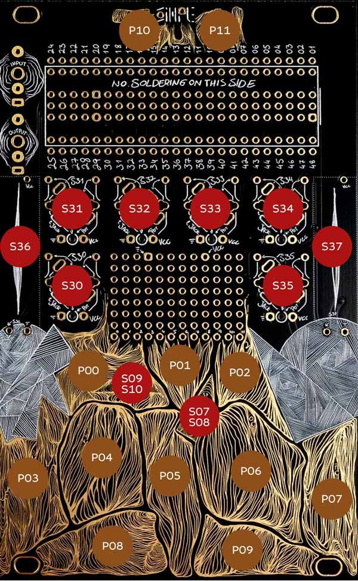

# This is TouchString

## Quick Install
Download the [binary file](https://github.com/Synthux-Academy/TouchString/releases/latest/download/TouchString.bin) and flash using the [Daisy Seed web programmer](https://electro-smith.github.io/Programmer/)

## Controls



### Pads
- P10 + P00 - tempo down
- P11 + P00 - previous scale
- P10 + P02 - tempo up
- P11 + P02 - next scale
- P03...P09 - note pads
- P10 - "TO" modifier | Hold to enable tempo control and alternative knob functions
- P11 - "CH" modifier | Hold to enable scale selection

### Knobs (clockwise)
- S30 **Brightness** | Controls filter brightness/cutoff frequency
- S31 **Pitch** | Global pitch transpose/tuning
- S32 **Timbre** | Sound structure/harmonic content
- S33 **Density** | Pattern density/complexity
- S33 + TO (pad 10) **Pattern Shift**
- S34 **Notes** | Humanization of note timing/variation
- S35 **String Chance** | Probability of string triggering
- S35 + TO (pad 10) **Reverb Mix**

### Faders
- S36 (left) **Drive** | Distortion/overdrive amount (reduces volume as drive increases)
- S37 (right) **Damp** | String damping/decay time

### Switches

- **A** (right)
  - **Down**: Arpeggiator Off
  - **Center**: Arpeggiator On
  - **Up**: Arpeggiator Latched

### LED Indicator

The onboard LED lit when latch is active.

## Project Structure
```
TouchString/
├── TouchString.cpp      # Main application entry point
├── Makefile             # Build configuration
|-- common               # Configuration and utilities
├── string/              # Instrument core
├── touch/               # Simple Touch wrapper (pads, knobs, switches)
├── ui/                  # UI connecting instrument core with touch wrapper
└── lib/                 # Libraries
    ├── libDaisy/        # Daisy hardware abstraction
    └── DaisySP/         # DSP library
```

## Project Setup
```shell
$ git clone --recurse-submodules https://github.com/Synthux-Academy/TouchString.git
$ make libs -j8
$ make clean; make -j8
```

## Configuration
Edit [config.h](https://github.com/Synthux-Academy/TouchString/blob/main/common/config.h) to customize the instrument.
